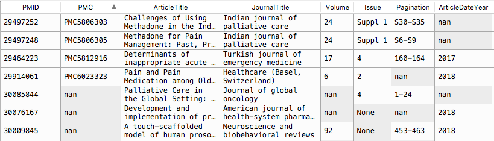
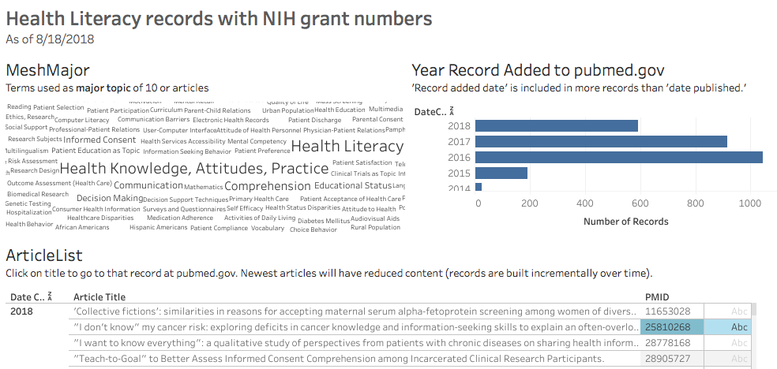

> :warning: **Might be obsolete**: The new UI does not have XML export as an option. Waiting to see if it gets added back in... But you might be able to adapt this to the currently available CSV export option.

# pubmed-gov_xml_2_python_dataframe

> A way to move pubmed.gov records into Pandas dataframes for further processing.

Use this Python script and these XSLT files when you want to work with pubmed.gov exports in Python. To get started, at pubmed.gov: 

- Run your search strategy
- ~~Send to > File > Format: XML
(September 2020, UI no longer has XML option)
- Update file name in py script
- Run.

More info inside py script.

## Infos

- Relies on the XML tag information at https://www.nlm.nih.gov/bsd/licensee/data_elements_doc.html. Not all tags are included here; you may need to update the XSLT depending on the work you are doing. For example this does NOT bring in PubmedBookArticle records (such as book chapter records).
- I am using exports of 20,000 records or less.
- Requires pandas and lxml packages. 
- Authored in Spyder editor; code blocks are separated with #%%.
- Serving suggestion - Video about a ColdFusion app that is out of date; the plan is to move it to Python-Flask or Python-Django. http://www.screencast.com/t/Yr7hdMxA. If asked, enter the following password: NewHLRev

## Serving suggestion
[Year/MeSH-Major drill-downs in Tableau](https://public.tableau.com/profile/danwendling#!/vizhome/Healthliteracy-NIHgrants/Healthliteracy-NIHgrants) (Use Download Workbook to understand that better)

