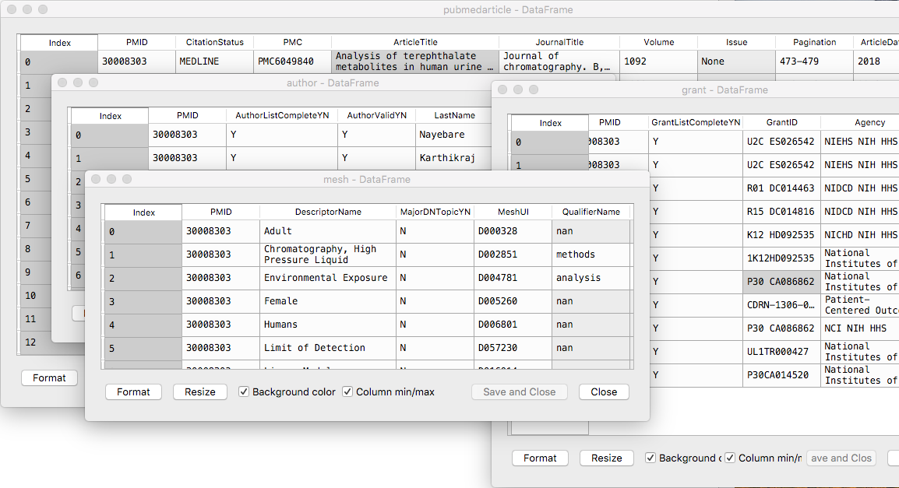

# pubmed-gov_xml_2_python_dataframe

> A way to move pubmed.gov records into Pandas dataframes for further processing.

Use this XSLT file and Python script when you want to work with pubmed.gov exports in Python. I am using 10,000 records or less.

At pubmed.gov: 

- Run your search strategy
- Send to > File > Format: XML
- Update file name in script

More info inside py file.

Requires pandas and lxml packages. Authored in spyder editor.

Serving suggestion - video about a ColdFusion app that is out of date; I hope to move it to Python-Flask or Python-Django:

> http://www.screencast.com/t/Yr7hdMxA 
> If asked, enter the following password: NewHLRev
